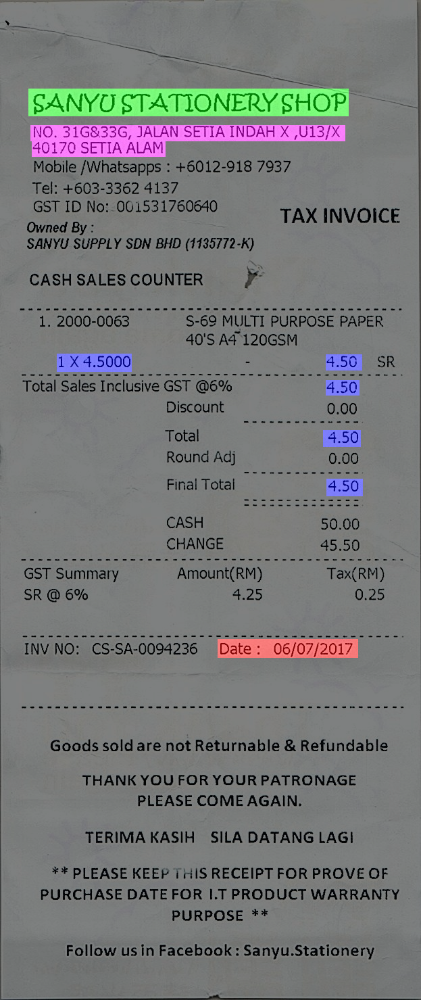

# Invoice Analysis System (IAS)

Invoice analysis is a process of understanding the information from an invoice image such as total amount, date, invoice provider details, etc.

### Datset
We use a dataset published in [ICDAR 19 competition](http://rrc.cvc.uab.es/?ch=13) to analyse the progress of our research.
Ones we got a good result based on our approach, we can scale it to our data.
This dataset have 584 images and two set of annotations as shown in the table.

|Image|Annotation1|Annotation1|
|--|--|--| 
||`366,241,597,241,597,259,366,259,PERNIJAGAAN ZHENG HUI 435,263,526,263,526,283,435,283,JM0325955-V 391,282,562,282,562,302,391,302,NO.59 JALAN PERMAS 9/5 377,299,578,299,578,315,377,315,BANDAR BARU PERMAS JAYA 407,319,549,319,549,336,407,336,81760 JOHOR BAHRU`| ` {"company": "PERNIAHAAN ZHENG HUI","date": "12/02/2018","address": "NO.59 JALAN PERMAS 9/5 BANDAR BARU PERMAS JAYA 81760 JOHOR BAHRU","total": "112.45"} `|
