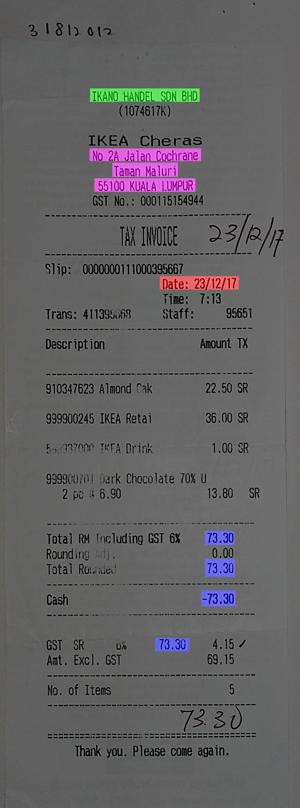
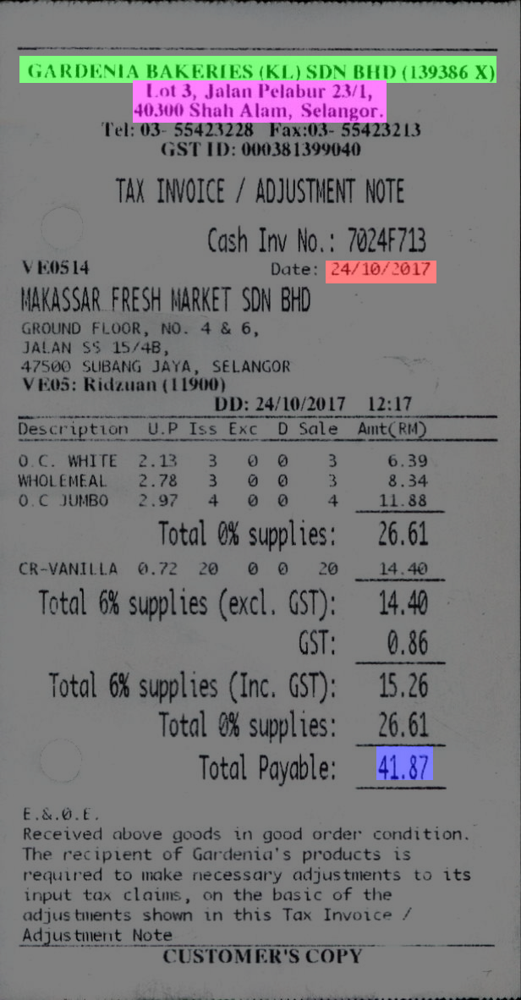
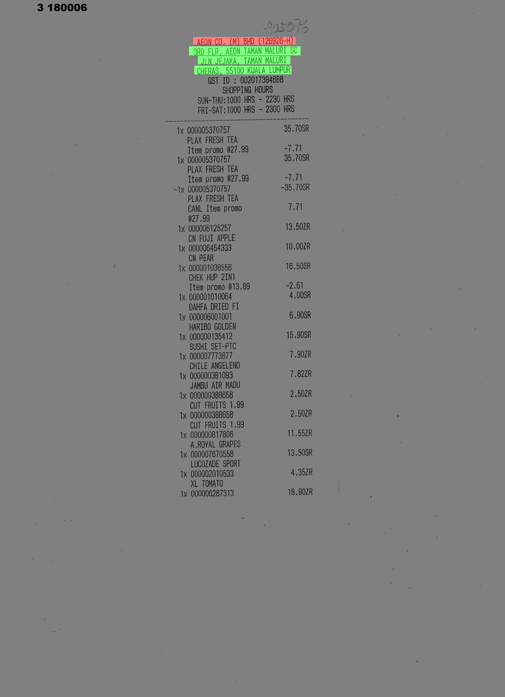
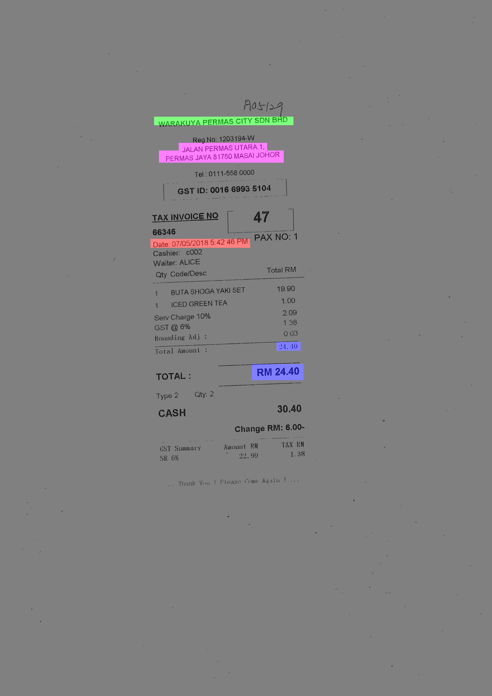

# Invoice Analysis System (IAS)

Invoice analysis is a process of understanding the information from an invoice image such as total amount, date, invoice provider details, etc.

### Datset
We use a dataset published in [ICDAR 19 competition](http://rrc.cvc.uab.es/?ch=13) to analyse the progress of our research.
Ones we got a good result based on our approach, we can scale it to our data.
This dataset have 584 images and two set of annotations as shown in the table.

- Green --> company name
- Blue --> Total amount
- Red --> Date
- Pink --> Company address

	
	
	
	

